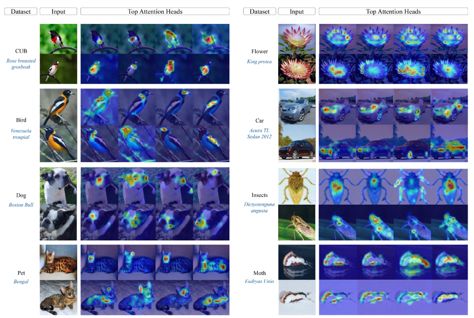

# :mag: Prompt-CAM: A *Simpler* Interpretable Transformer for Fine-Grained Analysis (CVPR'25)
🛠 GitHub will be uploaded soon! Stay tuned for the code release!

This is an official implementation for [PROMPT-CAM: A Simpler Interpretable Transformer for Fine-Grained Analysis](https://arxiv.org/pdf/2501.09333) (CVPR'25)

The question we ask:
<p align="center" style="color: blue;"></p>

$${\textcolor{blue}{\text{How can we leverage pre-trained ViTs, particularly their localized and informative patch features,}}}$$
$${\textcolor{blue}{\text{to identify traits that are special and specific for each fine-grained category?}}}$$


Introducing **Prompt-CAM**, a $${\textcolor{red}{\text{simple yet effective}}}$$ interpretable transformer that requires no architectural modifications to pre-trained ViTs.
- We inject **class-specific prompts** into ViTs, forcing the model to attend to image patches uniquely important to each class.
- This approach naturally unveils the most discriminative traits with clean, high-resolution attention maps—offering a near "free lunch" for interpretability in ViTs.
<p align="center">

</p>

```
@article{chowdhury2025prompt,
  title={Prompt-CAM: A Simpler Interpretable Transformer for Fine-Grained Analysis},
  author={Chowdhury, Arpita and Paul, Dipanjyoti and Mai, Zheda and Gu, Jianyang and Zhang, Ziheng and Mehrab, Kazi Sajeed and Campolongo, Elizabeth G and Rubenstein, Daniel and Stewart, Charles V and Karpatne, Anuj and others},
  journal={arXiv preprint arXiv:2501.09333},
  year={2025}
}
```
