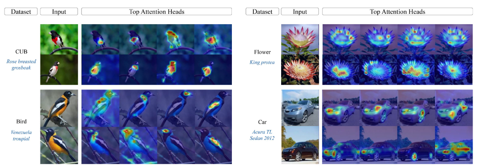

# :mag: Prompt-CAM: Making Vision Transformers Interpretable for Fine-Grained Analysis (CVPR'25)

This is an official implementation for [Prompt-CAM: Making Vision Transformers Interpretable for Fine-Grained Analysis](https://doi.org/10.1109/CVPR52734.2025.00413) (CVPR'25).

Introducing **Prompt-CAM**, a $${\textcolor{red}{\text{simple yet effective}}}$$ **interpretable transformer** that requires no architectural modifications to pre-trained ViTs, we just have to inject **class-specific prompts** into any ViT to make them interpretable.

Prompt CAM lets us explore:
- 🧠 What the model thinks is important for each class?
- ✨ Which traits are shared between two bird species?
- 🎨 How different classes ‘see’ the same image differently!

<p align="center">

</p>

## Update

Thank you for the people who created issues: 
- Now our code base supports `python 3.10` with updated `timm==1.0.24`
- Fixed minor visualization bugs
- Our codebase now supports both single and multi-gpu usage for training


## Quick Start: Try out the demo
🔍 Ever wondered what traits stand out when a model looks at an image of one class but searches with another class in mind? 🤔
Witness the important traits of different class through the lens of Prompt-CAM with our interactive demos! 

👉 Try our demo **without installing anything** in Gooogle Colab [](https://colab.research.google.com/drive/1co1P5LXSVb-g0hqv8Selfjq4WGxSpIFe?usp=sharing)

👉 Try our demo locally in [](demo.ipynb)
- Setup the [envoiroment](#environment-setup)
- download the pre-trained model from link below!
- run the demo.


👉  You can extend this code base to include: [New datasets](#to-add-a-new-dataset) and [New backbones](#to-add-a-new-backbone) 

 

## Environment Setup  
```bash 
conda create -n prompt_cam python=3.10
conda activate prompt_cam  
source env_setup.sh
```  


## Data Preparation
You can put all the data in a folder and pass the path to `--data_path` argument.

The structure of `data/images/`should be organized as follows:

```
cub/
├── train/
│   ├── 001.Black_footed_Albatross/
│   │   ├── image_1.jpg
│   │   ├── image_2.jpg
│   │   └── ...
│   ├── 002.Laysan_Albatross/
│   │   ├── image_1.jpg
│   │   ├── image_2.jpg
│   │   └── ...
│   └── ...
└── val/
    ├── 001.Black_footed_Albatross/
    │   ├── image_1.jpg
    │   ├── image_2.jpg
    │   └── ...
    ├── 002.Laysan_Albatross/
    │   ├── image_1.jpg
```

<details>
<summary>Prepare CUB dataset</summary>

## CUB

1. Download `CUB_200_2011.tgz` from [the official website](https://www.vision.caltech.edu/datasets/cub_200_2011/) and extract it:
    ```bash
    tar -xzf CUB_200_2011.tgz
    ```
    You will get a `CUB_200_2011/` folder containing `images/`, `images.txt`, and `train_test_split.txt`.

2. Run the preparation script to arrange the images into the required structure:
    ```bash
    python data/prepare_cub.py \
        --cub_dir /path/to/CUB_200_2011 \
        --out_dir /path/to/data/images/cub
    ```

The script uses the official train/test split and organises images into `cub/train/` and `cub/val/` with class folders named `NNN.ClassName` (e.g. `001.Black_footed_Albatross`).

</details>
<details>
<summary>Prepare Oxford Pet dataset</summary>

## Pet Dataset

1. Download both archives from [the official website](https://www.robots.ox.ac.uk/~vgg/data/pets/) and extract them:
    ```bash
    tar -xzf images.tar.gz
    tar -xzf annotations.tar.gz
    ```
    You will get an `images/` folder with all `.jpg` files and an `annotations/` folder containing `trainval.txt` and `test.txt`.

2. Run the preparation script to arrange the images into the required structure:
    ```bash
    python data/prepare_pet.py \
        --images_dir /path/to/images \
        --annotations_dir /path/to/annotations \
        --out_dir /path/to/data/images/pet
    ```

The script maps `trainval.txt` → `pet/train/` and `test.txt` → `pet/val/`, with class folders named `NNN.BreedName` (e.g. `001.Abyssinian`).

</details>

**To add new dataset, see [Extensions](#extensions)**

## Results + Checkpoints:
- Download the appropriate model checkpoint from our [Hugging Face repository](https://huggingface.co/imageomics/Prompt-CAM) and put it in the `checkpoints/{model}/{dataset}/` folder.

Backbone | Dataset | Prompt-CAM(Acc top%1) | Checkpoint Link|
--- | --- | --- | --- |
dino | cub (CUB)| 73.2 | [Prompt_CAM_checkpoint_dino_cub.pt](https://huggingface.co/imageomics/Prompt-CAM/blob/main/Prompt_CAM_checkpoint_dino_cub.pt) |
dino | car (Stanford Cars) | 83.2 | [url](https://drive.google.com/drive/folders/1UmHdGx4OtWCQ1GhHCrBArQeeX14FqwyY?usp=sharing) |
dino | dog (Stanford Dogs) | 81.1 |[url](https://drive.google.com/drive/folders/1UmHdGx4OtWCQ1GhHCrBArQeeX14FqwyY?usp=sharing) |
dino | pet (Oxford Pet) | 91.3 | [url](https://drive.google.com/drive/folders/1UmHdGx4OtWCQ1GhHCrBArQeeX14FqwyY?usp=sharing) |
dino | birds_525 (Birds-525) | 98.8 | [url](https://drive.google.com/drive/folders/1UmHdGx4OtWCQ1GhHCrBArQeeX14FqwyY?usp=sharing) |

Backbone | Dataset | Prompt-CAM(Acc top%1) | Checkpoint Link|
--- | --- | --- | --- |
dinov2 | cub (CUB) | 74.1 | [url](https://drive.google.com/drive/folders/1UmHdGx4OtWCQ1GhHCrBArQeeX14FqwyY?usp=sharing) |
dinov2 | dog (Stanford Dogs) | 81.3| [url](https://drive.google.com/drive/folders/1UmHdGx4OtWCQ1GhHCrBArQeeX14FqwyY?usp=sharing) |
dinov2 | pet (Oxford Pet) | 92.7 | [url](https://drive.google.com/drive/folders/1UmHdGx4OtWCQ1GhHCrBArQeeX14FqwyY?usp=sharing) |

## Evaluation and Visualization
- download the checkpoint from url in the [Table](#results--checkpoints) above and put it in the `checkpoints/{model}/{dataset}/` folder.

For example, to visualize the attention map of the DINO model on the class `024.Red_faced_Cormorant` of CUB dataset, put the checkpoint in `checkpoints/dino/cub/` folder and run the following command:

```python
CUDA_VISIBLE_DEVICES=0  python visualize.py --config ./experiment/config/prompt_cam/dino/cub/args.yaml --checkpoint ./checkpoints/dino/cub/model.pt --vis_cls 23
```

- The output will be saved in the `visualization/dino/cub/class_23/` folder. 
- Inside the individual image folder, there will be `top_traits` heatmaps for the target class concatenated if the prediction is correct. Otherwise, all the traits will be concatenated. (the prediction is for the respective image can be found `concatenated_prediction_{predicted_class}.jpg`).
<details>
<summary>Visualization Configuration Meaning</summary>

- `config`: path to the config file.
- `checkpoint`: path to the checkpoint file.
- `vis_cls`: class number to visualize. (default: 23)
- `vis_attn`: set to True to visualize the attention map. (default: True)
- `top_traits`: number of traits to visualize. (default: 4)
- `nmbr_samples`: number of images from the `vis_cls to visualize. (default: 10)
- `vis_outdir`: output directory. (default: visualization/)
</details>


## :fire: Training

### :one: Pretrained weights
---

Download the pretrained weights from the following links and put them in the `pretrained_weights` folder.     
1. [ViT-B-DINO](https://dl.fbaipublicfiles.com/dino/dino_vitbase16_pretrain/dino_vitbase16_pretrain.pth) rename it as `dino_vitbase16_pretrain.pth`
2. [ViT-B-DINOV2](https://dl.fbaipublicfiles.com/dinov2/dinov2_vitb14/dinov2_vitb14_pretrain.pth) rename it as `dinov2_vitb14_pretrain.pth`
### :two: Load dataset
---

See [Data Preparation](#data-preparation) above.
### :three: Start training
---

👉 To train the model on the `CUB dataset` using the `DINO` model, run the following command:
```python
CUDA_VISIBLE_DEVICES=0,1,2,3 torchrun --nproc_per_node=4 main.py --config ./experiment/config/prompt_cam/dino/cub/args.yaml --gpu_num 4

```
The checkpoint will be saved in the `output/vit_base_patch16_dino/cub/` folder. Copy the checkpoint `model.pt` to the `checkpoints/dino/cub/` folder.

---

👉 To train the model on the `Oxford Pet dataset` using the `DINO` model, run the following command:
```python
CUDA_VISIBLE_DEVICES=0,1,2,3 torchrun --nproc_per_node=4  main.py --config ./experiment/config/prompt_cam/dino/pet/args.yaml --gpu_num 4
```
The checkpoint will be saved in the `output/vit_base_patch14_dino/pet/` folder. Copy the checkpoint `model.pt` to the `checkpoints/dino/pet/` folder.

---

👉 To train the model on the `Oxford Pet dataset` using the `DINOv2` model, run the following command:
```python
CUDA_VISIBLE_DEVICES=0,1,2,3 torchrun --nproc_per_node=4 python main.py --config ./experiment/config/prompt_cam/dinov2/pet/args.yaml --gpu_num 4
```

The checkpoint will be saved in the `output/vit_base_patch14_dinov2/pet/` folder. Copy the checkpoint `model.pt` to the `checkpoints/dinov2/pet/` folder.

---

### :four: :mag: Visualize the attention map
---

See [Visualization](#evaluation-and-visualization) above.

## Extensions
### To add a new dataset
1. Prepare dataset using above [instructions](#data-preparation).
2. add a new dataset file in `/data/dataset`. [ Look at the existing dataset files for reference.](data/dataset/cub.py)
3. modify [build_loader.py](experiment/build_loader.py) to include the new dataset.
4. create a new config file in `experiment/config/prompt_cam/{model}/{dataset}/args.yaml` 
    - See `experiment/config/prompt_cam/dino/cub/args.yaml` for reference and what to modify.

### To add a new backbone
- modify `get_base_model()` in [build_model.py](experiment/build_model.py).
- register the new backbone in [vision_transformer.py](model/vision_transformer.py) by creating a new function.
- add another option in `--pretrained_weights` and `--model` in `setup_parser()` function of [main.py](main.py) to include the new backbone.


# Citation [](https://doi.org/10.1109/CVPR52734.2025.00413) [](https://openaccess.thecvf.com/content/CVPR2025/papers/Chowdhury_Prompt-CAM_Making_Vision_Transformers_Interpretable_for_Fine-Grained_Analysis_CVPR_2025_paper.pdf)

If you find this repository useful, please consider citing our work :pencil: and giving a star :star2: :
```
@InProceedings{Chowdhury_2025_CVPR,
    author    = {Chowdhury, Arpita and Paul, Dipanjyoti and Mai, Zheda and Gu, Jianyang and Zhang, Ziheng and Mehrab, Kazi Sajeed and Campolongo, Elizabeth G. and Rubenstein, Daniel and Stewart, Charles V. and Karpatne, Anuj and Berger-Wolf, Tanya and Su, Yu and Chao, Wei-Lun},
    title     = {Prompt-CAM: Making Vision Transformers Interpretable for Fine-Grained Analysis},
    booktitle = {Proceedings of the IEEE/CVF Conference on Computer Vision and Pattern Recognition (CVPR)},
    month     = {June},
    year      = {2025},
    pages     = {4375-4385}
}
```
### Acknowledgement

- VPT: https://github.com/KMnP/vpt 
- PETL_VISION: https://github.com/OSU-MLB/PETL_Vision  

Thanks for their wonderful works.

🛠 create an issue for any contributions.
